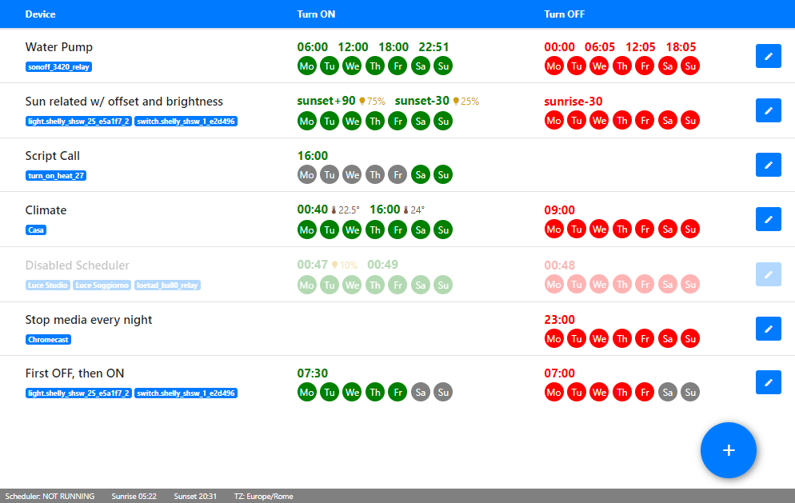

# SimpleScheduler
An Home Assistant AddOn to schedule switches and lights on weekly basis in a visual way without coding.
You can keep all the schedules in one place and add/changhe in a few clicks.

### Installation
You can add the url of this page in your "add-on store" as a new repository. Click refresh and you will find the add-on "Simple Scheduler" listed.

### How to use it
The add-on is very easy and intuitive (or, at least, that's what I hope)
Once installed, open the GUI or click on the sidebar (if you choose to add to it)
Just click on the round plus button in the bottom right and add your first schedule.
Choose the switch/light from the dropdown, fill the ON time (in 24 hours format, as suggested) and select the weekdays. Do the same for the OFF time and click "save".
That's it!
It's not mandatory to add both ON and OFF time. You can leave one of them empty if you don't need it.
For example: you want to turn off a light every day at 22:00, but you don't need to turn it on.
You can then edit any of the schedule with the icon at the end of the row.
You can also choose to delete it or disable it (the schedule will stay there, but it will not be executed until you enable it back)

### Two words about the stored data
Every schedule (or row, if you prefer) is a json file stored in the [share/simplescheduler] folder under the SAMBA share.
This give the chance to the data to "survive" to an addon upgrade or reinstallation.
You can easily backup them and restore in case of failure. In the same way you can (accidentally?) delete them. So be aware of that.

### Last but not the list
If you want to convince me to stay up at night, just <a target="_blank" href="https://www.buymeacoffee.com/arthurdent75">buy me a beer 🍺</a>
You may say that regular people needs coffee to do that. Well, I'm not like the others.

PS: The answer is 42
